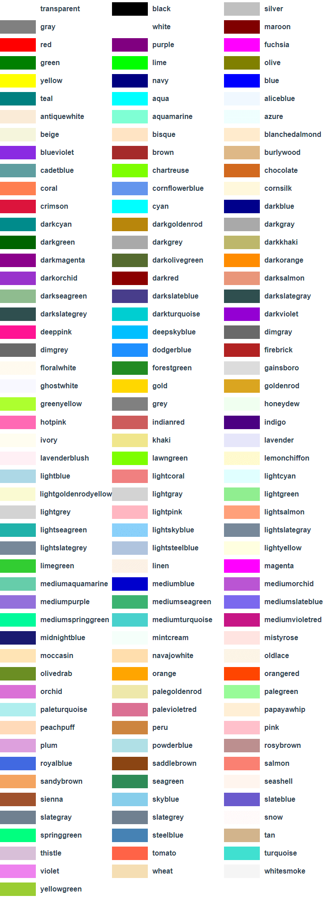

[ENGLISH](./README_EN.md)

<h1 align="center">Color Extension</h1>

<p align="center">
    <a href="https://travis-ci.com/jiaming743/Color"></a>
    <a href="https://github.com/jiaming743/Color/blob/master/LICENSE"> </a>
    <a href="https://www.npmjs.com/package/@jiaminghi/color"> </a>
</p>

### 这是一个提供如下几个方法的颜色插件。

- **[darken](#darken)**

  加深颜色

- **[lighten](#lighten)**

  提亮颜色

- **[fade](#fade)**

  调节颜色透明度

- **[toHex](#toHex)**

  转换成Hex颜色

- **[toRgb](#toRgb)**

  将颜色转为Rgb或Rgba颜色

- **[getOpacity](#getOpacity)**

  获取颜色透明度

- **[getRgbValue](#getRgbValue)**

  获取颜色的Rgb值

- **[getRgbaValue](#getRgbaValue)**

  获取颜色的Rgba值

- **[getColorFromRgbValue](#getColorFromRgbValue)**

  从Rgb或Rgba值获取颜色

### 附录

- **[颜色关键字](#颜色关键字)**

  内置颜色关键字

### npm安装

```shell
$ npm install @jiaminghi/color
```

### 使用

```javascript
import { toHex } from '@jiaminghi/color'

// do something
```

### 快速体验

```html
<!--资源位于个人服务器仅供体验和测试，请勿在生产环境使用-->
<!--调试版-->
<script src="http://lib.jiaminghi.com/color/color.map.js"></script>
<!--压缩版-->
<script src="http://lib.jiaminghi.com/color/color.min.js"></script>
<script>
  const { darken, lighten } = window.color
  // do something
</script>
```

------

<h3 align="center">示例</h3>

#### darken

```javascript
/**
 * @description 加深颜色
 * @param {String} color   Hex|Rgb|Rgba颜色或颜色关键字
 * @param {Number} percent 加深的百分比 (1-100)
 * @return {String|Boolean} Rgba颜色 (无效输入将返回false)
 */
function darken (color, percent) {
	//...
}

const before = '#3080E8'

const after = darken(color, 20)
// after = 'rgba(0,77,181,1)'
```

<p align="center">
    
</p>


#### lighten

```javascript
/**
 * @description 提亮颜色
 * @param {String} color   Hex|Rgb|Rgba颜色或颜色关键字
 * @param {Number} percent 提亮的百分比 (1-100)
 * @return {String|Boolean} Rgba颜色 (无效输入将返回false)
 */
function lighten (color, percent) {
	//...
}

const before = '#3080E8'

const after = lighten(color, 20)
// after = 'rgba(99,179,255,1)'
```

<p align="center">
    
</p>


#### fade

```javascript
/**
 * @description 调节颜色透明度
 * @param {String} color   Hex|Rgb|Rgba颜色或颜色关键字
 * @param {Number} Percent 透明度百分比
 * @return {String|Boolean} Rgba颜色 (无效输入将返回false)
 */
function fade (color, percent) {
	//...
}

const before = '#3080E8'

const after = lighten(color, 20)
// after = 'rgba(48,128,232,0.2)'
```

<p align="center">
    
</p>


#### toHex

```javascript
/**
 * @description 转换成Hex颜色
 * @param {String} color Hex|Rgb|Rgba颜色或颜色关键字
 * @return {String|Boolean} Hex颜色 (无效输入将返回false)
 */
function toHex (color) {
	//...
}

const before = 'rgb(48,128,232)'

const after = toHex(before)
// after = '#3080e8'
```


#### toRgb

```javascript
/**
 * @description 将颜色转为Rgb或Rgba颜色
 * @param {String} color   Hex|Rgb|Rgba颜色或颜色关键字
 * @param {Number} opacity 颜色的透明度 (输入该参数将生成Rgba颜色)
 * @return {String|Boolean} Rgb或Rgba颜色 (无效输入将返回false)
 */
function toRgb (color, opacity) {
	//...
}

const before = '#3080E8'

const after1 = toRgb(before)
// after1 = 'rgb(48,128,232)'
const after2 = toRgb(before, 0.2)
// after2 = 'rgba(48,128,232,0.2)'
```


#### getOpacity

```javascript
/**
 * @description 获取颜色透明度
 * @param {String} color Hex|Rgb|Rgba颜色或颜色关键字
 * @return {Number|Boolean} 颜色透明度 (无效输入将返回false)
 */
function getOpacity (color) {
	//...
}

const color1 = '#3080E8'
const color2 = 'rgba(48,128,232,0.2)'

const opacity1 = getOpacity(color1)
// opacity1 = 1
const opacity2 = getOpacity(color2)
// opacity2 = 0.2
```


#### getRgbValue

```javascript
/**
 * @description 获取颜色的Rgb值
 * @param {String} color Hex|Rgb|Rgba颜色或颜色关键字
 * @return {Array<Number>|Boolean} Rgb值 (无效输入将返回false)
 */
function getRgbValue (color) {
	//...
}

const color = '#3080E8'

const rgbValue = getRgbValue(color)
// rgbValue = [48, 128, 232]
```


#### getRgbaValue

```javascript
/**
 * @description 获取颜色的Rgba值
 * @param {String} color Hex|Rgb|Rgba颜色或颜色关键字
 * @return {Array<Number>|Boolean} Rgba值 (无效输入将返回false)
 */
function getRgbaValue (color) {
	//...
}

const color1 = '#3080E8'
const color2 = 'rgba(48,128,232,0.2)'

const rgbaValue1 = getRgbaValue(color1)
// rgbaValue1 = [48, 128, 232, 1]
const rgbaValue2 = getRgbaValue(color2)
// rgbaValue2 = [48, 128, 232, 0.2]
```


#### getColorFromRgbValue

```javascript
/**
 * @description 从Rgb或Rgba值获取颜色
 * @param {Array<Number>} value Rgb或Rgba颜色的值
 * @return {String|Boolean} Rgb颜色或Rgba颜色 (无效输入将返回false)
 */
function getColorFromRgbValue (value) {
	//...
}

const value1 = [48, 128, 232]
const value2 = [48, 128, 232, 0.2]

const color1 = getColorFromRgbValue(value1)
// color1 = 'rgb(48,128,232)'
const color2 = getColorFromRgbValue(value2)
// color2 = 'rgba(48,128,232,0.2)'
```


#### 颜色关键字

<p align="center">
    
</p>
